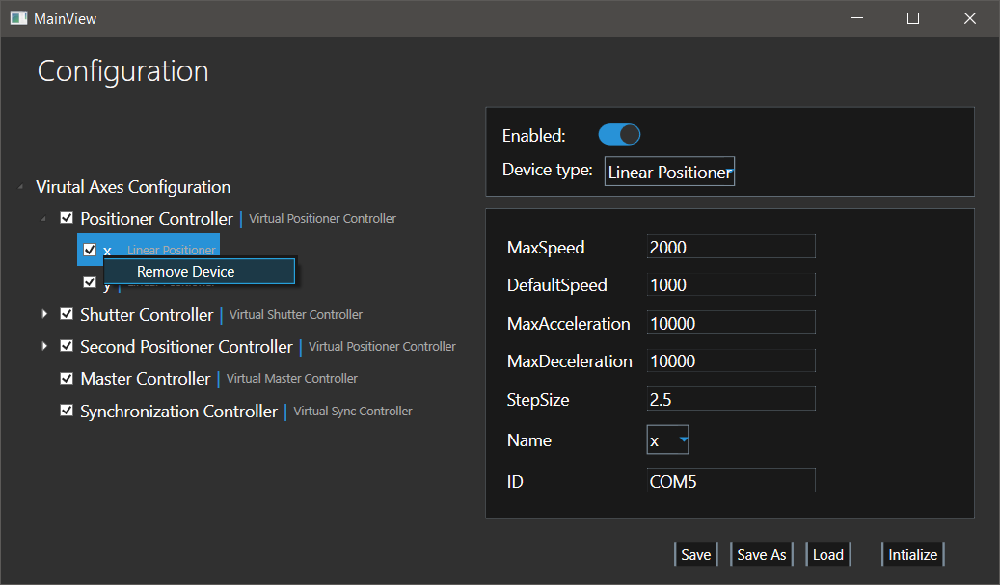
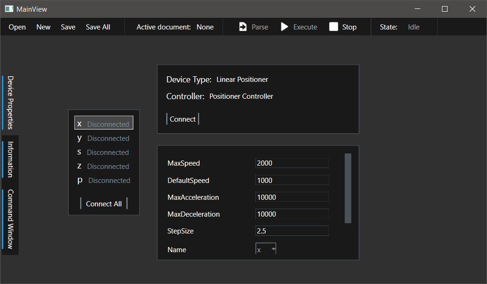
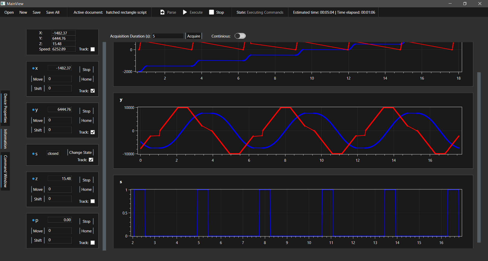
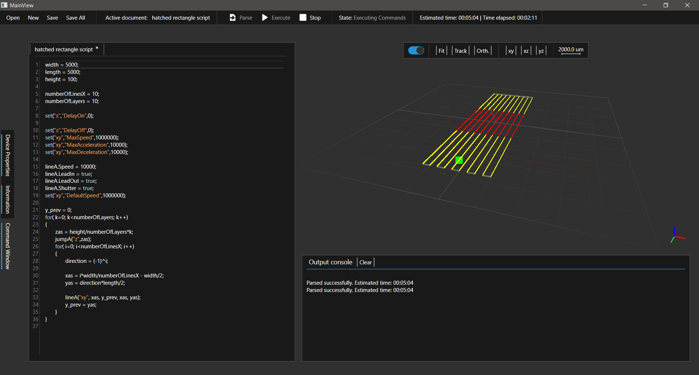

## Overview

This application is designed to provide precise motion control for "Standa" stages used in laser micro-fabrication. By integrating simple motion planning, scripting, and real-time visualization, it allows users to configure and execute complex movement sequences with high accuracy. The system is built to manage direct and master-controller-based stage control, ensuring efficient and seamless operation.

## Features

Key capabilities of this application include:

- **Advanced Motion Control**: Supports direct and master-controller-based stage control.

- **Custom Scripting Support**: Allows users to define movement sequences.

- **Configuration Management**: Easy setup and modification of controllers and devices.

- **Live Data Acquisition**: Tracks and logs movement parameters for analysis.

- **Graphical Visualization**: Displays movement commands and real-time tool positioning. It uses OpenGL for rendering and GLControl for integrating the visual output into the WPF application, ensuring smooth and accurate visualization of stage movements.

- **Text Parsing via ANTLR4**: Enables scripting and command execution for automation, making it easy to create and modify commands.

- **Multiple Movement Types**:

  - **Jumps**: Moves stages without a calculated trajectory.
  - **Lines**: Ensures the tool moves in a straight line with optional lead-in/out to maintain constant velocity.
  - **Arcs**: Allows smooth arc movements based on a given radius and angles.

- **Configuration Management**:

  - Tree-structured configuration for controllers and devices.
  - Load, Save, and Modify system configuration via JSON.
  - Enforces coordinate constraints with forced stop mechanisms.

- **Command Execution and Scripting**:

  - Supports a custom scripting language for automation.
  - Commands parsed and visualized before execution.

- **Live Tracking and Data Acquisition**:

  - Real-time tracking of device positions, speeds, and states.
  - Graphical visualization of movement data.

## Configuration Creation Window

The Configuration window allows users to create and modify system configurations, including controllers and device assembly.

- Configurations are displayed in a tree list with hierarchy: **Configuration Parameters → Controllers → Devices**.
- Right-clicking on items in the tree list provides options for adding controllers, devices, or removing elements.
- Controllers and devices have configurable parameters such as **Minimal/Maximal Coordinates** to enforce movement constraints.
- Configurations can be saved, loaded, or modified via JSON files.

## Device Properties Window

After initializing a configuration, a new window allows users to:

- View device properties, both static and dynamically changeable.
- Connect and initialize each device for proper functionality.
- Enable real-time tracking of device states such as position and speed.

## Information Window

This window provides real-time monitoring of positioner and shutter devices.

- **Device Control Blocks**: Each device is listed with key control actions like **Stop**, **Home**, **Move**, and **Shift**.
- **State Tracking**: Devices can be assigned to tracking mode, logging their states over time.
- **Graph Visualization**: Plots of position, speed, and shutter states are generated dynamically.

## Command Window



The Command Window facilitates the creation and execution of motion control commands.

- **Script Editor**: Users can write commands in a custom scripting language powered by ANTLR4 for precise text parsing.
- **Renderer**: Provides a visual preview of queued command sequences, leveraging OpenGL for high-performance visualization.
- **Execution Panel**: Commands can be executed in real-time with control over start, stop, and parsing functions.
- **Console Output**: Displays system messages, errors, and execution logs.


## Movement Commands

This application supports different movement types, allowing for precise tool positioning and control. Stages can be controlled directly or via a master controller.

### Jump to Absolute Position

```sh
jumpA("xy", 100, 150);
```

Moves the `x` and `y` stages to positions `100` and `150` without a calculated trajectory.

### Move in a Line

```sh
lineA("xy", 10, 20, 100, 150);
```

Moves the tool from `(10, 20)` to `(100, 150)`, ensuring a straight-line trajectory with optional lead-in/out for maintaining constant velocity.

### Arc Movement

```sh
arcA("xy", 100, 10, 20, 3.14, 6.28, true);
```

Moves in an arc around the center `(10, 20)`, from `π` to `2π`, counterclockwise.

